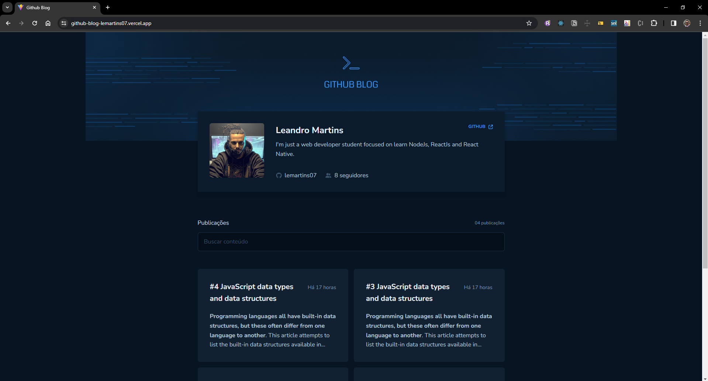

<h1 align="center">
  Ignite Github Blog
</h1>

  <a href="#-layout">Layout</a>&nbsp;&nbsp;&nbsp;|&nbsp;&nbsp;&nbsp;
  <a href="#-projeto">Projeto</a>&nbsp;&nbsp;&nbsp;|&nbsp;&nbsp;&nbsp;
  <a href="#-tecnologias">Tecnologias</a>&nbsp;&nbsp;&nbsp;|&nbsp;&nbsp;&nbsp;    
  <a href="#-demo">Demo</a>&nbsp;&nbsp;&nbsp;|&nbsp;&nbsp;&nbsp;    
  <a href="#memo-licença">Licença</a>

 

  

## 💻 Projeto

O Ignite Github Blog é uma aplicação que utiliza a API do GitHub para criar um blog. Esta aplicação apresenta as seguintes funcionalidades:

- Página principal: exibe as informações do usuário e uma lista de issues, simulando posts de blog.
- Página de detalhes do post: mostra todo o conteúdo do post.

Este projeto foi proposto como desafio no módulo "Consumo de API e performance no ReactJS" da trilha de ReactJS do curso Ignite da Rocketseat. O objetivo principal era desenvolver uma aplicação completa, integrando conceitos fundamentais do ecossistema React abordados durante o módulo, tais como ContextAPI, useState, useEffect, styled-components, entre outros.

## 🚀 Tecnologias

Esse projeto foi desenvolvido com as seguintes tecnologias:

- Reactjs
- Vite
- Typescript
- ContextApi
- Styled Components

## Demo

<a href="https://github-blog-lemartins07.vercel.app/" target="_blank">Clique aqui</a> para ver a demo do projeto.

## 📝 Licença

Esse projeto está sob a licença MIT. Veja o arquivo [LICENSE](LICENSE.md) para mais detalhes.

---
